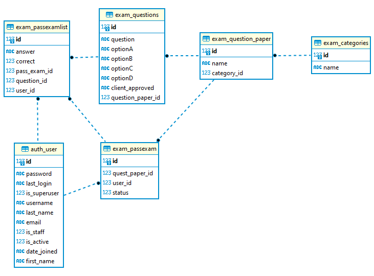

# Экзаменатор

#### Система онлайн-экзаменов представляет собой цифровую платформу, которая позволяет легко и просто оценивать студентов. Весь процесс экзамена упрощен, экзамены можно сдавать где угодно и когда угодно.
#### Он разработан с использованием Python, Django, CSS, HTML и VUEjs. Говоря о проекте, он содержит административную часть, с помощью которой пользователь может легко сдавать экзамены и управлять ими. 

---------------------------------------------------------------------------------------------------------------------
#### Функциональные части сервера:

- Регистрация, аутентификация пользователей
- Зарегистрированные пользователи могут
    - Проходить любой из тестовых наборов
    - Последовательный ответ на все вопросы, каждый вопрос выводится на новой странице с отправкой формы (перескакивать через тесты или оставлять неотмеченными нельзя)
    - Можно продолжить не законченные тестирование по каким то причинам.
- После завершения тестирования система покажеть результат: 
    - количество правильных/неправильных ответов
    - процент правильных ответов
- Стандартная админка Django. Разделы
    - Стандартный раздел пользователей
    - Раздел с наборами тестов
        - Возможность на странице набора тестов добавлять вопросы/ответы к вопросам/отмечать правильные ответы
        - Валидация на то, что должен быть хотябы 1 правильный вариант
        - Валидация на то, что все варианты не могут быть правильными
        - Удаление вопросов/вариантов ответов/изменение правильных решении при редактировании тестового набора

---------------------------------------------------------------------------------------------------------------------

#### Схема БД

---------------------------------------------------------------------------------------------------------------------

## Для запуска проекта
Clone project to your computer

	git clone https://github.com/nurzhan1990/exam.git

Install require packages

	pip install -r requirements.txt

Migrate project

	python3 manage.py migrate
		
Run your server on your localhost

	python3 manage.py runserver